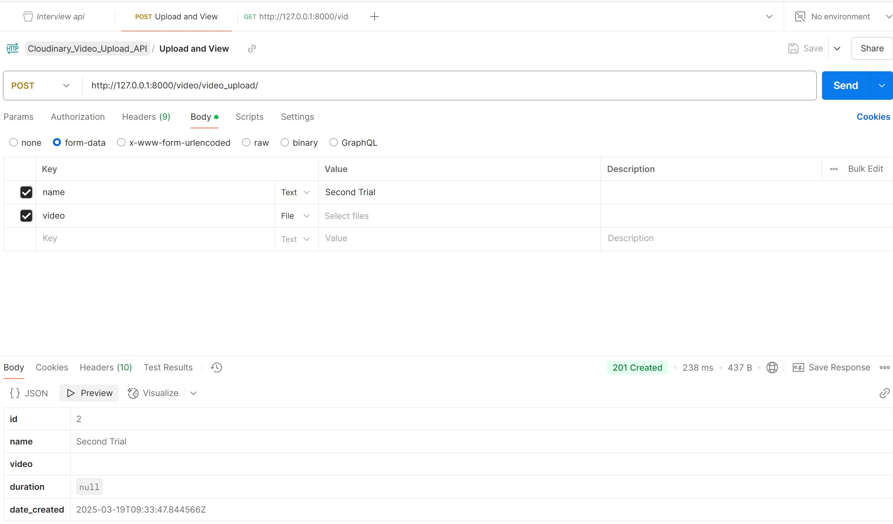

# TASK 4: video upload API using AWS S3 or Cloudinary

## CLOUDINARY:
 This is a Third party API integrated using the SDK.

## This API uses only one end point to Upload a new video(GET) and to view uploaded videos.

- ### GET: http://127.0.0.1:8000/video/video_upload/ 

This endpoint can be used to Fetch existing video uploads with GET request. 

- ### POST: http://127.0.0.1:8000/video/video_upload/

This endpoint is used to Create new video upload with a POST request, with fields(name and video), while other fields will be auto-generated.

- ### POSTMAN Documentation:

https://universal-astronaut-438943.postman.co/workspace/MY_FIRST_WORKSPACE~11e31e18-68b6-43fa-b115-9602519d48ea/collection/27321084-8d5491de-2fee-4512-bff4-f7d4c4dc178a?action=share&creator=27321084
